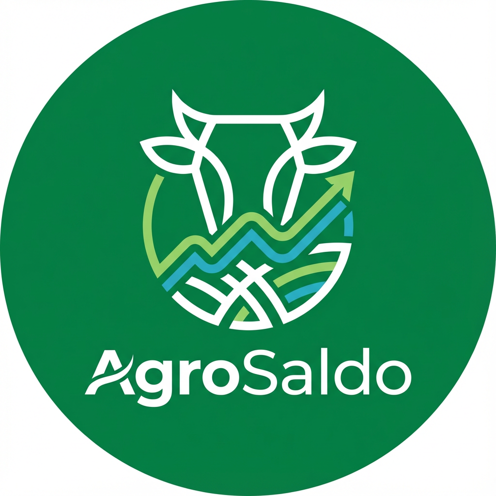

# AgroSaldo – Gestão Inteligente de Rebanhos

> Plataforma web para produtores rurais acompanharem o rebanho em tempo real, registrar movimentações (nascimentos, mortes, vendas), automatizar regras sanitárias e compartilhar relatórios executivos.



## 📌 Sumário

1. [Visão Geral](#-visão-geral)
2. [Principais Funcionalidades](#-principais-funcionalidades)
3. [Stack Tecnológica](#-stack-tecnológica)
4. [Pré-requisitos](#-pré-requisitos)
5. [Setup Rápido](#-setup-rápido)
6. [Scripts Disponíveis](#-scripts-disponíveis)
7. [Estrutura de Pastas](#-estrutura-de-pastas)
8. [Fluxos Críticos](#-fluxos-críticos)
9. [Qualidade & Testes](#-qualidade--testes)
10. [Documentação Complementar](#-documentação-complementar)
11. [Roadmap e Próximos Passos](#-roadmap-e-próximos-passos)
12. [Contribuindo](#-contribuindo)

---

## 🎯 Visão Geral

O AgroSaldo foi pensado para produtores que precisam centralizar informações de rebanho, registrar GTAs, garantir conformidade sanitária e gerar relatórios executivos (incluindo PDF com brasão oficial). A aplicação é _offline-first_, possui integrações com WhatsApp para compartilhamento rápido e segue uma arquitetura modular documentada em `docs/`.

Principais problemas resolvidos:

- Consolidação de dados de rebanho por faixa etária e propriedade.
- Registro de movimentações com validações complexas (matrizes, GTA, CPF/CNPJ).
- Evolução automática de faixas etárias com agendamento diário.
- Geração de relatórios PDF oficiais e compartilhamento via WhatsApp.
- Painéis administrativos para aprovações, clientes e planos.

---

## 🚀 Principais Funcionalidades

- **Dashboard Produtor:** visão completa do rebanho, KPIs e atalhos para PDF/WhatsApp.
- **LaunchForm avançado:** formulário com validações Zod, upload de fotos (CameraCapture) e sincronização com IndexedDB.
- **Sistema de migração etária (`src/lib/age-group-migration.ts`):** recalcula faixas automaticamente e registra histórico.
- **Compartilhamento WhatsApp (`src/lib/whatsapp-share.ts`):** formatação rica e fallback para clipboard.
- **Admin Suite:** páginas para aprovação de solicitações, gestão de planos e CRM.
- **Offline-first:** IndexedDB + fila de sincronização, com toasts informando status.
- **Relatórios PDF oficiais:** contemplam brasão, assinatura digital e campos normativos (CPF/CNPJ, inscrição estadual, código da propriedade).

---

## 🧱 Stack Tecnológica

- **Frontend:** React 18 + TypeScript + Vite 7.
- **Design System:** shadcn/ui + Radix UI + Tailwind CSS.
- **Estado & Formulários:** React Hook Form, Zod, TanStack Query (async data).
- **Charts & Visualizações:** ApexCharts, Recharts.
- **Offline & Storage:** IndexedDB (`idb`), LocalStorage, Service Worker (PWA-ready).
- **Testes:** Jest + Testing Library (unit), Playwright (E2E).

Veja mais detalhes arquiteturais em [`docs/ARQUITETURA.md`](docs/ARQUITETURA.md).

---

## ⚙️ Pré-requisitos

- Node.js 20+ (use [nvm](https://github.com/nvm-sh/nvm#installing-and-updating) para gerenciar versões)
- npm 10+
- Git

Opcional:
- Playwright browsers instalados (`npx playwright install`)
- Extensão React Developer Tools

---

## 🏁 Setup Rápido

```bash
# 1) Clonar o repositório
git clone <YOUR_GIT_URL>
cd agrosaldo

# 2) Instalar dependências
npm install

# 3) Copiar variáveis de ambiente (se aplicável)
cp .env.example .env.local

# 4) Rodar em modo desenvolvimento
npm run dev

# 5) Abrir http://localhost:5173
```

Para executar os testes unitários:

```bash
npm test           # Jest
npm run test:watch # Hot reload
npm run test:coverage
```

---

## 📜 Scripts Disponíveis

| Script | Descrição |
| --- | --- |
| `npm run dev` | Servidor Vite com HMR |
| `npm run build` | Build otimizado para produção |
| `npm run preview` | Servir build gerado |
| `npm run lint` | ESLint (TypeScript + React Hooks rules) |
| `npm test` | Suite Jest + Testing Library |
| `npm run test:e2e` | Testes Playwright |
| `npm run test:coverage` | Relatório de cobertura Jest |

---

## 🗂️ Estrutura de Pastas

```
agrosaldo/
├── src/
│   ├── pages/                 # Dashboard, LaunchForm, Admin, etc.
│   ├── components/            # Layouts, CameraCapture, UI shadcn
│   ├── lib/                   # Regras de negócio e integrações
│   │   ├── age-group-migration.ts
│   │   ├── whatsapp-share.ts
│   │   ├── pdf-report.ts
│   │   └── db.ts (IndexedDB + sync)
│   ├── contexts/AuthContext.tsx
│   ├── hooks/ (useIsMobile, useSyncStatus, useToast...)
│   └── mocks/ (dados seed para prototipação)
├── tests/                     # Playwright specs
├── docs/                      # PRD, arquitetura, checklists
├── public/                    # Manifest, assets, service worker
└── config files (vite, tsconfig, eslint, jest, tailwind...)
```

---

## 🔁 Fluxos Críticos

1. **Autenticação multi-tenant** – `AuthContext` carrega usuário/propriedade e salva em LocalStorage.
2. **Registro de movimentos** – `LaunchForm` → validações Zod → `saveMovement()` → IndexedDB/sync queue → toasts.
3. **Sincronização offline** – listeners verificam `navigator.onLine`, reprocessam fila (`syncMovements`) e notificam usuário.
4. **Análise e relatórios** – `getRebanhoData()` alimenta ApexCharts, PDF e WhatsApp share.
5. **Administração** – páginas em `src/pages/admin/` controlam planos, aprovações e CRM.

Detalhes visuais e diagramas completos em [`docs/ARQUITETURA.md`](docs/ARQUITETURA.md) e [`docs/FINAL-REPORT.md`](docs/FINAL-REPORT.md).

---

## ✅ Qualidade & Testes

- **Unitários:** mais de 30 casos em `src/lib/__tests__/critical-business-rules.test.ts`, cobrindo validações de GTA, migração etária, formatações e edge cases.
- **Hooks & utilitários:** specs em `src/hooks/__tests__/` e `src/lib/__tests__/`.
- **E2E:** suíte Playwright (`tests/*.spec.ts`) cobrindo autenticação, lançamentos, extrato e aprovações admin.
- **Lint + TypeScript strict:** `npm run lint` e `tsconfig` com `strict: true` garantem ausência de `any` implícito.

KPIs atuais (ver `docs/FINAL-REPORT.md` @docs/FINAL-REPORT.md#168-178): 100% regras P0 cobertas, 30+ testes unitários e documentação completa.

---

## 📚 Documentação Complementar

| Documento | Conteúdo |
| --- | --- |
| [`docs/ARQUITETURA.md`](docs/ARQUITETURA.md) | Diagramas e fluxo de dados detalhado |
| [`docs/CHECKLIST-IMPLEMENTACAO.md`](docs/CHECKLIST-IMPLEMENTACAO.md) | 50+ tarefas priorizadas |
| [`docs/FINAL-REPORT.md`](docs/FINAL-REPORT.md) | Sumário executivo da sessão 12/01/2026 |
| `.github/ROADMAP-EXECUTIVO.md` | Marcos e métricas estratégicas |
| `.github/IMPLEMENTACOES-SESSAO-12JAN.md` | Diário técnico da sprint |

---

## 🗺️ Roadmap e Próximos Passos

Trecho resumido do plano (ver `docs/FINAL-REPORT.md` @docs/FINAL-REPORT.md#196-227):

1. **Semana corrente:** Sincronização offline completa, geração de PDF real, filtros do extrato.
2. **Semanas 2-3:** CRUD Admin completo, testes E2E adicionais, build/deploy em staging.
3. **Fevereiro+:** Backend NestJS, integração com APIs reais e release em produção.

Status atual: 🟢 ON TRACK (12/01/2026).

---

## 🤝 Contribuindo

1. Crie uma _branch_ a partir de `main`.
2. Mantenha commits focados e com mensagens claras.
3. Garanta `npm run lint && npm test` antes de abrir PR.
4. Atualize documentação relevante (README, `docs/`, comentários).

Dúvidas ou sugestões? Abra uma issue ou registre no roadmap executivo.
